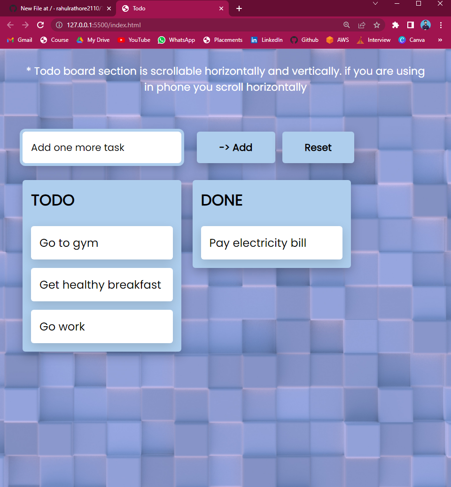
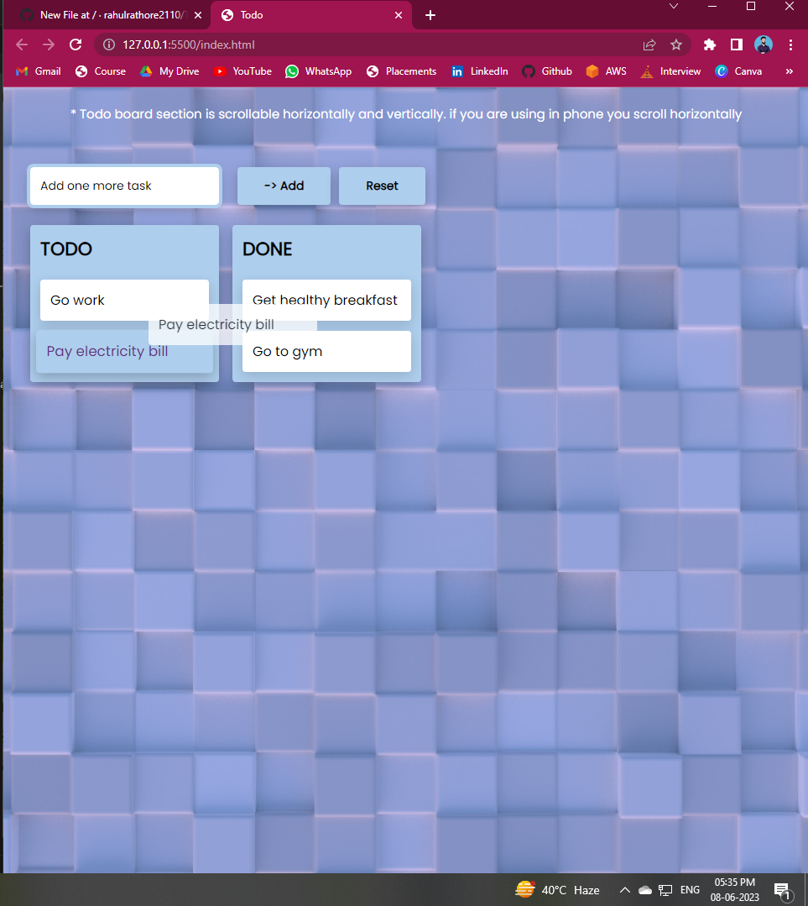
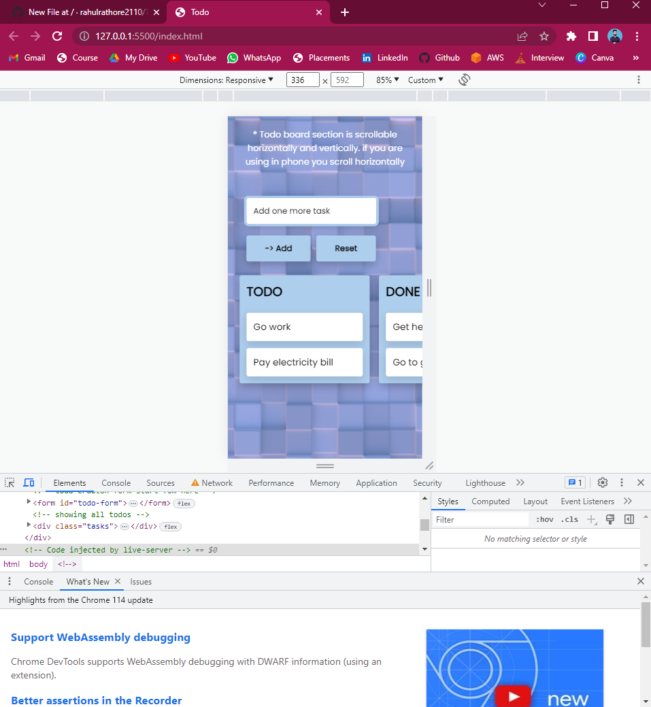

# Todo
Daily task orgnizing app.

You can add Todos for according to your convinience.
  - write the todo description in the text box.
  - and then press add button to add todo in the list
  
  
you can change the state of the todo.
  - simply drag and drop of each task from one to another box.
  - when you drag the task app will pick task with your mouse and drop other side.
  
   
you can reset the todo for their original state.
  - simply click on the reset button you app will reset.
  
Appliacation is reponsive for all devices.

